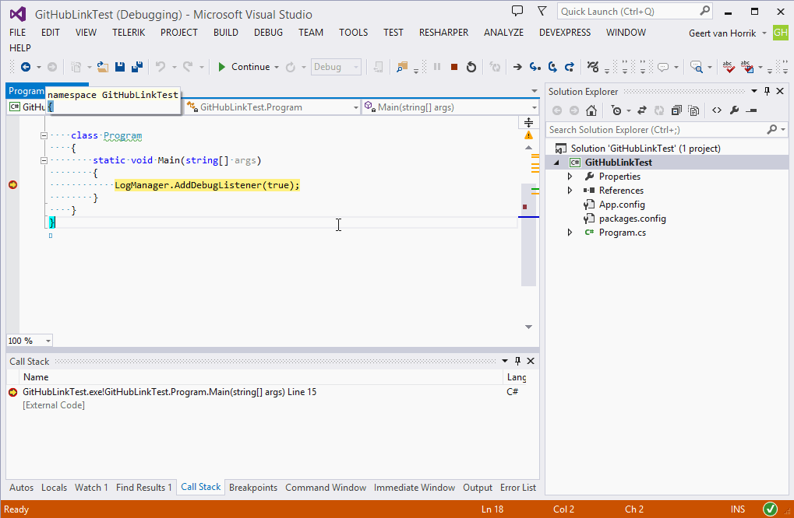

GitHubLink
==========

GitHubLink let's users step through your code hosted on GitHub! **Help making .NET open source projects more accessible by enabling this for your .NET projects, it's just a single additional step in your build**. See the list of [projects using GitHubLink](#ProjectsUsingGitHubLink).

GitHubLink makes symbol servers obsolete which saves you both time with uploading source files with symbols and the user no longer has to specify custom symbol servers (such as symbolsource.org).

  

The idea is based on the <a href="https://github.com/ctaggart/SourceLink"  target="_blank">SourceLink project</a>. However it requires FAKE and not everyone likes to write code in F#. GitHubLink is available as console application and can be references as assembly as well to be used in other .NET assemblies.

The advantage of GitHubLink is that it is fully customized for GitHub. It also works with GitHub urls so it **does not require a local git repository to work**. This makes it perfectly usable in continuous integration servers such as <a href="http://www.finalbuilder.com/Continua-CI" target="_blank">Continua CI</a>.

Updating all the pdb files is very fast. A solution with over 85 projects will be handled in less than 30 seconds.

When using GitHubLink, the user no longer has to specify symbol servers. He/she only has to enable the support for source servers in Visual Studio as shown in the image below:

  

# Using GitHubLink as command line tool #

Using GitHubLink via the command line is very simple:

1. Build the software (in release mode with pdb files enabled)
2. Run the console application with the right command line parameters

Below are a few examples.

## Running for the default branch ##

    GitHubLink.exe c:\source\catel -u https://github.com/catel/catel 

This will use the default branch (which is in most cases **master**). You can find out the default branch by checking what branch is loaded by default on the GitHub page.

## Running for a specific branch ##

    GitHubLink.exe c:\source\catel -u https://github.com/catel/catel -b develop

This will use the develop branch.

## Running for a specific branch and configuration ##

    GitHubLink.exe c:\source\catel -u https://github.com/catel/catel -b develop -c debug

This will use the develop branch and the debug configuration.

## Getting help ##

When you need help about GitHubLink, use the following command line:

    GitHubLink.exe -help

## Logging to a file ##

When you need to log the information to a file, use the following command line:

    GitHubLink.exe c:\source\catel -u https://github.com/catel/catel -b develop -l GitHubLinkLog.log

# Using GitHubLink in code #

GitHubLink is built with 2 usages in mind: command line and code reference. Though most people will use the command line version, it is possible to reference the executable and use the logic in code.

The command line implementation uses the same available API. 

## Creating a context ##

To link files to a GitHub project, a context must be created. The command line version does this by using the *ArgumentParser* class. It is also possible to create a context from scratch as shown in the example below:

    var context = new GitHubLink.Context();
    context.SolutionDirectory = @"c:\source\catel";
    context.TargetUrl = "https://github.com/catel/catel";
    context.TargetBranch = "develop";

It is possible to create a context based on command line arguments:

    var context = ArgumentParser.Parse(@"c:\source\catel -u https://github.com/catel/catel -b develop");

## Linking a context ##

Once a context is created, the *Linker* class can be used to actually link the files:

    Linker.Link(context);

# How to get GitHubLink #

There are three general ways to get GitHubLink:.

## Get it from GitHub ##

The releases will be available as separate executable download on the [releases tab](https://github.com/GeertvanHorrik/GitHubLink/releases) of the project.

## Get it via Chocolatey ##

If you want to install the tool on your (build) computer, the package is available via <a href="https://chocolatey.org/" target="_blank">Chocolatey</a>. To install, use the following command:

    cinst GitHubLink

## Get it via NuGet ##

If you want to reference the assembly to use it in code, the recommended way to get it is via <a href="http://www.nuget.org/" target="_blank">NuGet</a>. 

**Note that getting GitHubLink via NuGet will add it as a reference to the project**

# How does it work #

The SrcSrv tool (Srcsrv.dll) enables a client to retrieve the exact version of the source files that were used to build an application. Because the source code for a module can change between versions and over the course of years, it is important to look at the source code as it existed when the version of the module in question was built.

For more information, see the <a href="http://msdn.microsoft.com/en-us/library/windows/hardware/ff558791(v=vs.85).aspx" target="_blank">official documentation of SrcSrv</a>.

GitHubLink creates a source index file and updates the PDB file so it will retrieve the files from the GitHub file handler.

# Projects using GitHubLink #

Below is a list of projects already using GitHubLink.

- <a href="http://www.catelproject.com" target="_blank">Catel</a>
- <a href="https://github.com/GeertvanHorrik/GitHubLink" target="_blank">GitHubLink</a>

Are you using GitHubLink in your projects? Let us know and we will add your project to the list.

*Note that you can also create a pull request on this document and add it yourself.* 
 

# Icon #

Link by Dominic Whittle from The Noun Project